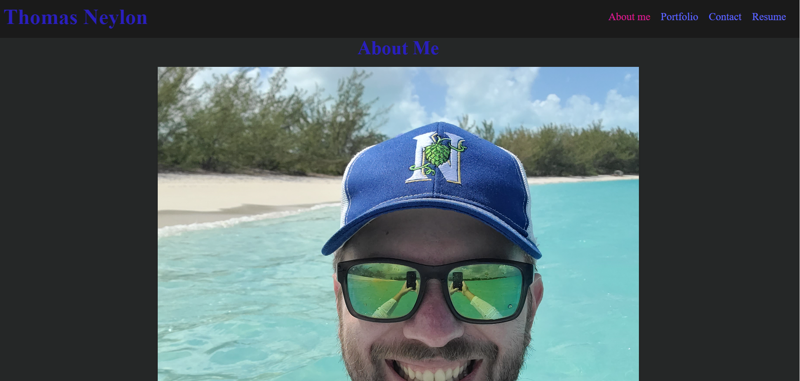
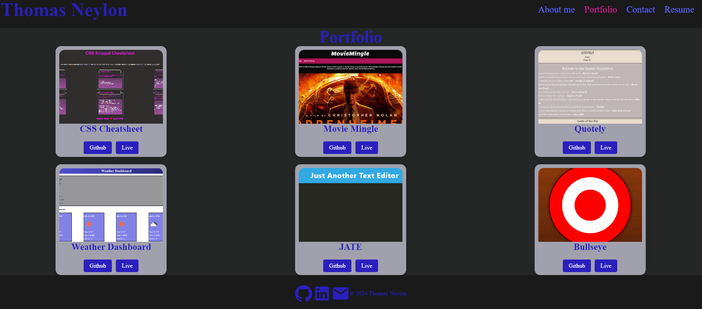
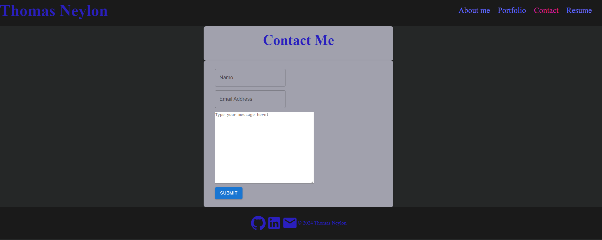
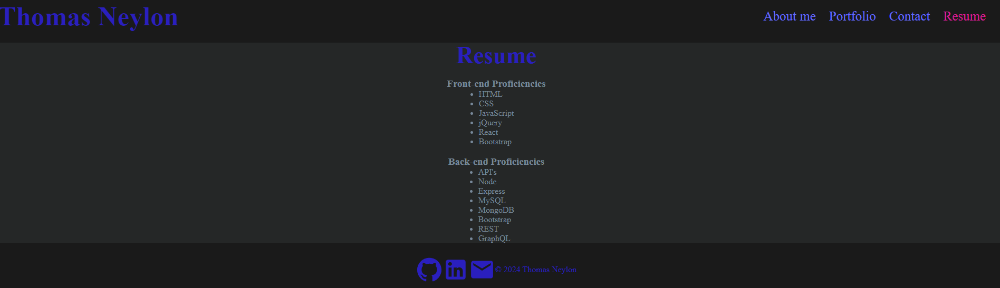

# React Portfolio

## Live Link
[Portfolio](https://neylon-thomas.netlify.app/)

## Description
    - As a developer I wanted to be able showcase my skills as a developer by creating a portfolio using react
    - This project was built to allow potential employers to view projects I have created along with the site that was built using react
    - This project allowed me to learn how to create a react web site from the ground up. I learned how to use multiple librarys, to change states, build contact forms, and display projects. Realistically I have only scratched the surface of React.
    

## Installation
    No installation Required

## Usage
    This single page react portfolio, can be navigated through the links, to see projects, about me, resume, and contact pages, via the link at the top of the readme.

   

## Liscence
    MIT

## Code Source
    Code fully written by Thomas Neylon, references were made to previous classwork, and the websites below, along with multiple youtube guides to building react portfolios and web sites. Co-pilot was also utilized in writing this code.
    
[Pedro Tech](https://www.youtube.com/watch?v=x7mwVn2z3Sk)
   
[Webdecoded](https://www.youtube.com/watch?v=hYv6BM2fWd8&list=PLd0qRSEDFQI7DgB5BKHQrryFlR02n1bK-)

[Great Stack](https://www.youtube.com/watch?v=hkHHwA-vEyQ)

[Pop on hover](https://blog.hubspot.com/website/css-hover-animation)

[Pop on hover](https://stackoverflow.com/questions/28345222/css3-keyframe-animation-which-runs-on-hover)

[React Forms](https://www.youtube.com/watch?v=Xts0kksSc8c)

[React Forms](https://www.youtube.com/watch?v=GjsxNvNAPi4)

